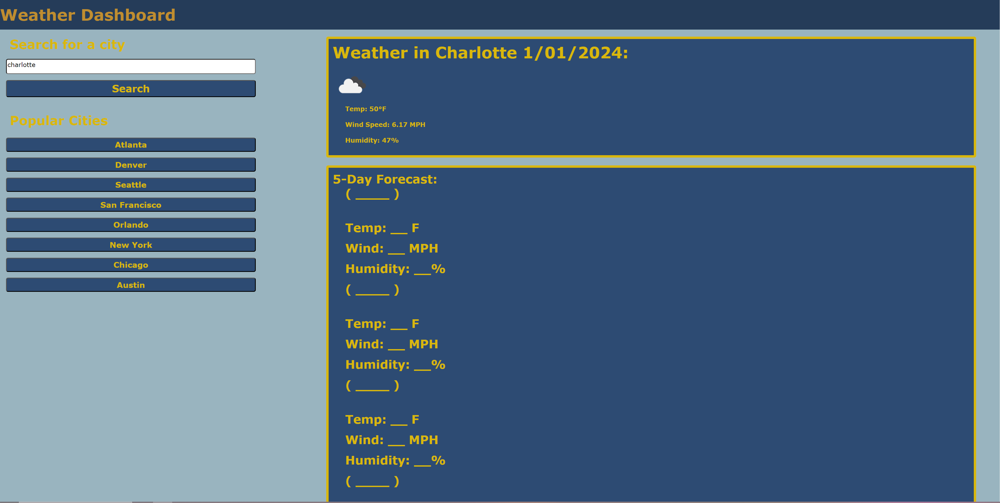

# <Weather-Dashboard>

## Description

Provide a short description explaining the what, why, and how of your project. Use the following questions as a guide:

- What was your motivation?

    My motivation was to really test my skills from what i've learned in every previous lesson. This project not only used api but website design using css and html from previous lessons. This helps me visualize what something i could create really looks like.

- Why did you build this project? (Note: the answer is not "Because it was a homework assignment.")

    I built this assignment to learn more about apis and how simple the code really is when you break it down. Though apis still confuse me a small bit this project was a step to learn more about them and where the information comes from.

- What problem does it solve?

    This solves the problem of incorporating api into webpages as its a basic skill used in search bars all over any website. This allows me to copy this skill into other future projects.

- What did you learn?

    I learned how to use apis in a very simple way, though i can't figure out how to use api to get a five day forecast, all it will take is a little more practice to find where the information is stored. Overall this homework assignment has helped me polish up all of my skills learned so far.


## Table of Contents (Optional)

If your README is long, add a table of contents to make it easy for users to find what they need.

- [Installation](#installation)
- [Usage](#usage)
- [Credits](#credits)
- [License](#license)

## Installation

What are the steps required to install your project? Provide a step-by-step description of how to get the development environment running.

## Usage

Provide instructions and examples for use. Include screenshots as needed.

To add a screenshot, create an `assets/images` folder in your repository and upload your screenshot to it. Then, using the relative filepath, add it to your README using the following syntax:

    ```md
  
    ```

## Credits

List your collaborators, if any, with links to their GitHub profiles.

If you used any third-party assets that require attribution, list the creators with links to their primary web presence in this section.

If you followed tutorials, include links to those here as well.

## License

The last section of a high-quality README file is the license. This lets other developers know what they can and cannot do with your project. If you need help choosing a license, refer to [https://choosealicense.com/](https://choosealicense.com/).

---

🏆 The previous sections are the bare minimum, and your project will ultimately determine the content of this document. You might also want to consider adding the following sections.

## Badges


Badges aren't necessary, per se, but they demonstrate street cred. Badges let other developers know that you know what you're doing. Check out the badges hosted by [shields.io](https://shields.io/). You may not understand what they all represent now, but you will in time.

## Features

If your project has a lot of features, list them here.

## How to Contribute

If you created an application or package and would like other developers to contribute it, you can include guidelines for how to do so. The [Contributor Covenant](https://www.contributor-covenant.org/) is an industry standard, but you can always write your own if you'd prefer.

## Tests

Go the extra mile and write tests for your application. Then provide examples on how to run them here.